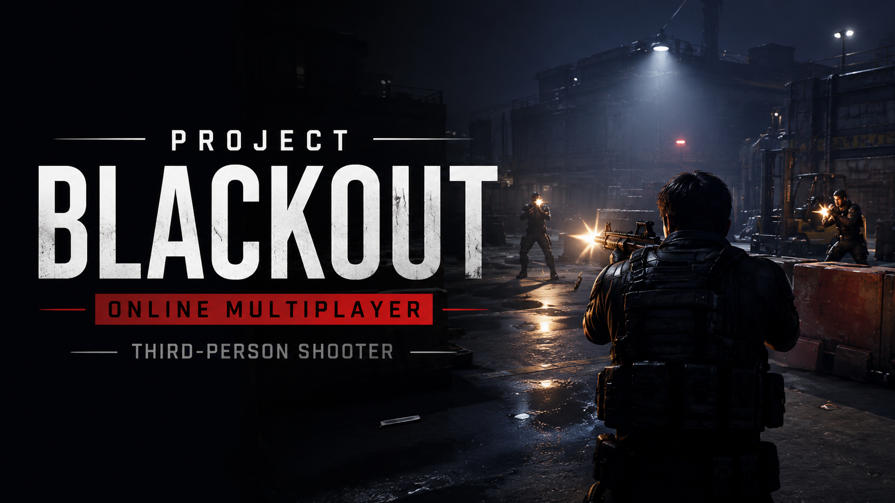
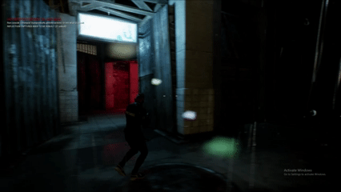

# Project Blackout

  

An online multiplayer third-person shooter developed in Unreal Engine 5.

## Gameplay

  

Full Gameplay Video:

https://www.youtube.com/watch?v=YOUR_VIDEO_LINK

---

## Overview

Project Blackout is an online multiplayer third-person shooter prototype developed using Unreal Engine 5.

The project focuses on networked gameplay, player synchronization, combat interactions, and multiplayer session management.

---

## Technical Details

| Category         | Details              |
| ---------------- | -------------------- |
| Engine           | Unreal Engine 5      |
| Genre            | Third-Person Shooter |
| Platform         | PC                   |
| Mode             | Online Multiplayer   |
| Networking Model | Host-Based Sessions  |
| Role             | Solo Developer       |

---

## Features

- Online Multiplayer Gameplay
- Host-Based Session System
- Third-Person Shooter Mechanics
- Networked Player Movement
- Multiplayer Combat
- UI Integration

---

## Responsibilities

- Gameplay Programming
- Multiplayer Networking
- Replication Setup
- RPC Implementation
- Session Creation & Joining
- Character Systems
- Combat Systems
- UI Development

---

## Key Learnings

- Unreal Engine 5 Networking
- Replication Workflows
- Remote Procedure Calls (RPCs)
- Multiplayer Session Management
- Multiplayer Debugging

---

## Developer

Abdulmajeed Alshammari

Gameplay Programmer
